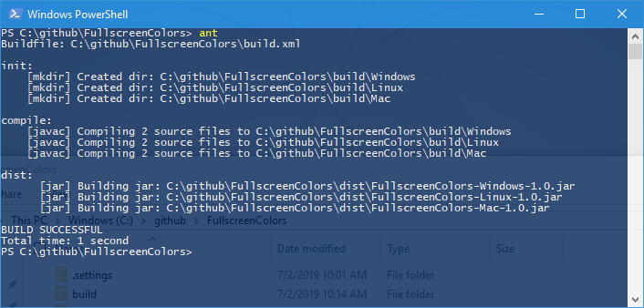

# FullscreenColors

A simple SWT fullscreen application running on primary monitor. When user hits any key application will draw random color. Application can be terminated by *CTRL+Q* 
keys.

Requires Java10 and newer.

### Build

Building application can be done through Eclipse IDE or through ant build script. Run ant inside project directory and binaries will be generated in dist folder.

### Development

1. Import project into Eclipse IDE
2. Refer to SWT binary for your platform (x86_64 platform binaries included)

Please note that classpath refers to Windows library by default.
